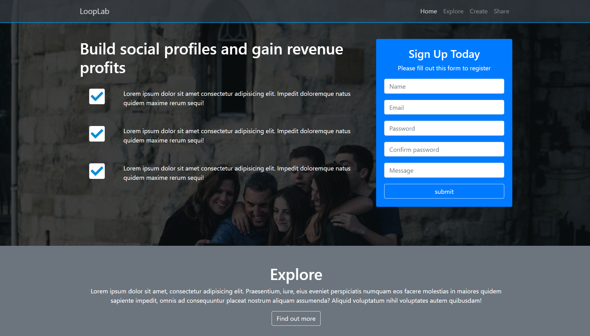
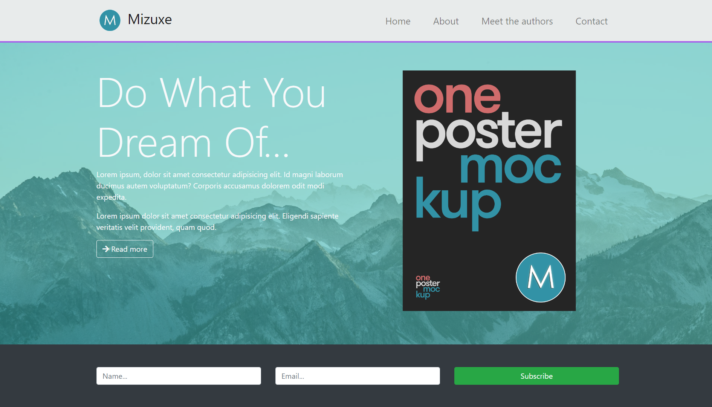

# Bootstrap-projects-3

This is a Bootstrap project done by me.

Also checkout my notes on bootstrap :-

a) [Bootstrap Notes](./bootstrapNotes.md)

b) [Design elements](./designElements.md)

Here are the links for the three projects click on the images to check out the original websites.

1. [LoopLab](https://sh-rawan.github.io/Bootstrap-projects-3/website1/index.html)
 

   
 

2. [Mizuxe](https://sh-rawan.github.io/Bootstrap-projects-3/website2/index.html)
 

   
 

3. [Glozzom](https://sh-rawan.github.io/Bootstrap-projects-3/website3/index.html)
 

   
 

